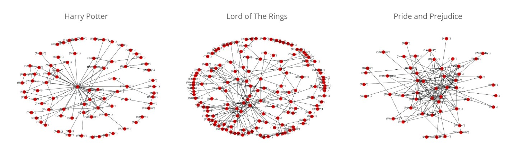

# Book Worm

### A cross platform mobile application for matching books with readers
    
   

## Inspiration 
Character Interaction Graphs provide a way for us to look into the narrative structure of book and dynamics between characters.

<iframe src="Screenshots/HP_graph.html" width=520 height=520 >
</iframe>

They also provide an excellent opportunity to compare different genres of books. The shapes of graphs of three books Harry Potter, Lord of the Rings and Pride and Prejudice are shown below:

> Source https://github.com/harrisonpim/bookworm

We can conclude that Harry potter is more similar to LOTR than Pride and Prjudice and hence we can recommend books based on that.

## What it does 

We take all the books in a library and compare each and every book against every other book to prepare a `n*n` matrix of comparison scores. When a user requests a book recommendation, we go through the list and find most similar books.

## How we built it
We have built a cross platform mobile application built using Flutter that will work on Android/IOS phones, desktops and as a website.

The NLP code was written using python with SpaCy and NLTK libraries

We have built a Django Server for backend management

## Steps to reproduce

### Mobile App
**Step 1**: Install Flutter using latest official guide [`https://flutter.dev/docs/get-started/install`](https://flutter.dev/docs/get-started/install)

**Step 2**: Run application using  `flutter run` in `App` folder

### Server
**Step 1**: Install Django 2.0 using `pip install Django==2.0`

**Step 2**: Run server using `python manage.py runserver` in `Server` folder

